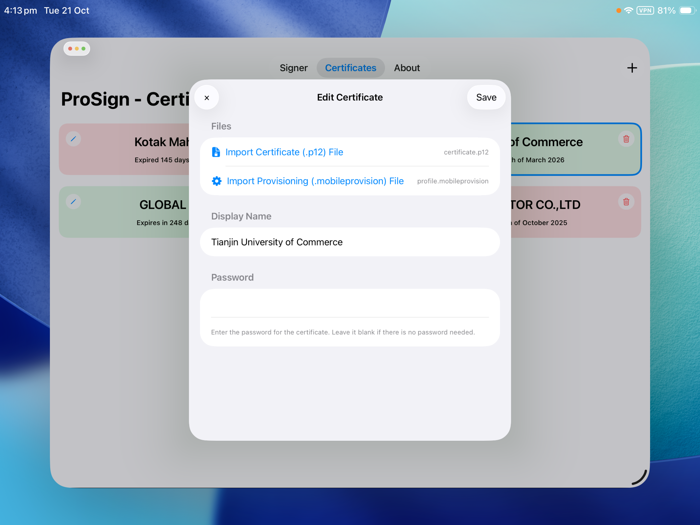

# The ProSign app for iOS
The best on-device `.ipa` signer for iOS!  
ProSign app source URL: https://prostore-ios.github.io/apps.json

---

## Install ProSign

- <a href="https://ProStore-iOS.github.io/sourceRedirect.html?app=altstore">Add to AltStore</a>  
- <a href="https://ProStore-iOS.github.io/sourceRedirect.html?app=sidestore">Add to SideStore</a>  
- <a href="https://ProStore-iOS.github.io/sourceRedirect.html?app=esign">Add to ESign</a>  
- <a href="https://ProStore-iOS.github.io/sourceRedirect.html?app=scarlet">Add to Scarlet</a>

---

## Credits
- **SuperGamer474** — Developer  
- **ChatGPT** — Assistance
- **[Khcrysalis](https://github.com/khcrysalis/)** - Creator of the [Zsign Package](https://github.com/khcrysalis/Zsign-Package)

---

## Gallery
&nbsp;
&nbsp;
&nbsp;
&nbsp;

---

# To-Do
- [x] Implement certificate selection functionality on the Signing page.
- [x] Fix issue causing certain page titles to not display correctly.
- [x] Correct colour inconsistencies on the Certificates page.
- [x] Replace status text with a progress bar on the Signing page.
- [ ] Display certificate status indicators: *Revoked*, *Signed*, or *Expiring Soon*.
- [ ] Resolve missing file errors in upload fields.
- [ ] Add expiry dates to certificates.
- [ ] Include an option to add official certificates when adding new certs.
