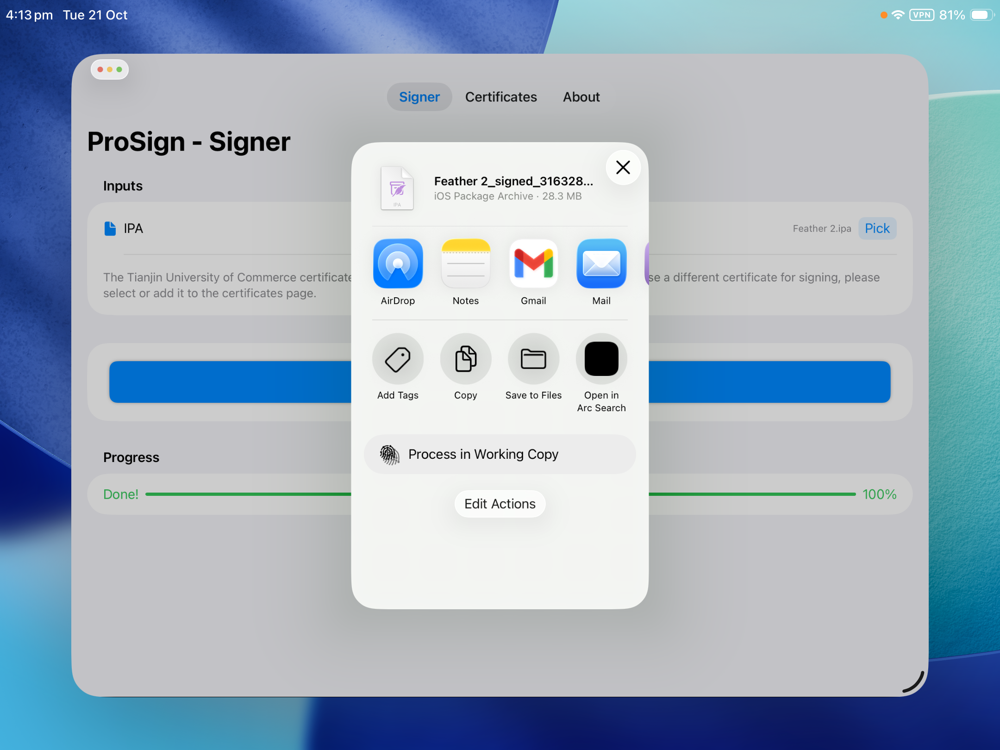
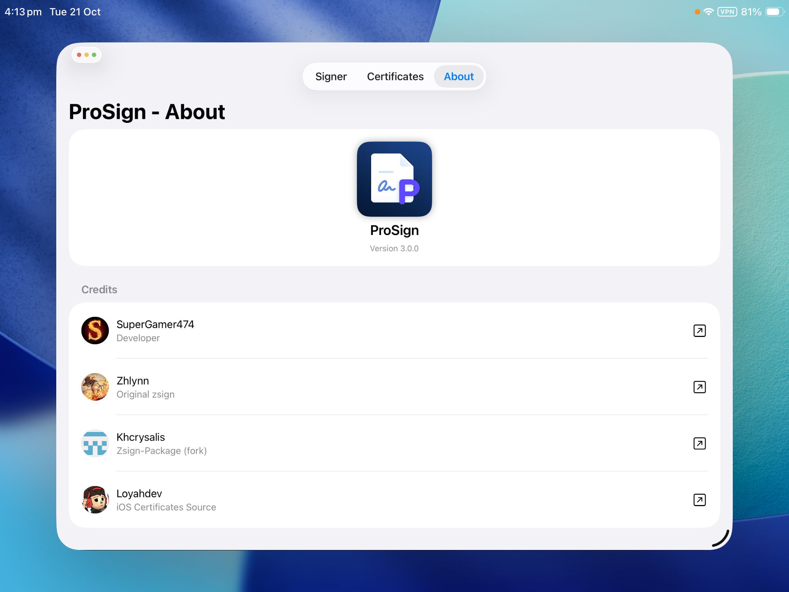

# The ProSign app for iOS
The best on-device `.ipa` signer for iOS!  
ProSign app source URL: https://prostore-ios.github.io/apps.json

---

## Install ProSign

- <a href="https://ProStore-iOS.github.io/sourceRedirect.html?app=altstore">Add to AltStore</a>  
- <a href="https://ProStore-iOS.github.io/sourceRedirect.html?app=sidestore">Add to SideStore</a>  
- <a href="https://ProStore-iOS.github.io/sourceRedirect.html?app=esign">Add to ESign</a>  
- <a href="https://ProStore-iOS.github.io/sourceRedirect.html?app=scarlet">Add to Scarlet</a>

---

## Gallery
&nbsp;
&nbsp;
&nbsp;
&nbsp;

---

# To-Do
- [x] Implement certificate selection on the Signing page.
- [x] Resolve issue causing some page titles to not display correctly.
- [x] Resolve color inconsistencies on the Certificates page
- [ ] Display certificate status indicators: *Revoked*, *Signed*, or *Expiring Soon*.
